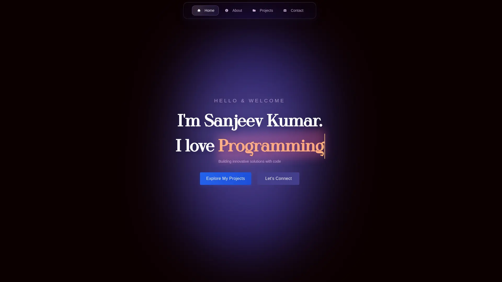

# 🚀 Portfolio Website

A modern, responsive portfolio website built with React, TypeScript, and Tailwind CSS, showcasing my projects, skills, and experience as a Computer Science Engineering student.



## 👨‍💻 About

I'm **Sanjeev Kumar**, a Computer Science Engineering student with expertise in AI, machine learning, and full-stack development. This portfolio showcases my journey in building innovative solutions that make a real difference.

## ✨ Features

- **Modern Design**: Clean, responsive UI built with Tailwind CSS
- **Interactive Sections**: Hero, About, Projects, and Contact sections
- **Project Showcase**: Detailed project cards with live demos and source code links
- **Skills Display**: Comprehensive overview of technical skills with icons
- **Contact Integration**: Direct email functionality using EmailJS
- **SEO Optimized**: Proper meta tags and search engine optimization
- **Performance Optimized**: Built with Vite for fast loading and optimal performance
- **Analytics**: Integrated with Vercel Analytics and Speed Insights

## 🛠️ Tech Stack

### Frontend

- **React 19** - Modern UI library
- **TypeScript** - Type-safe JavaScript
- **Tailwind CSS 4** - Utility-first CSS framework
- **React Icons** - Beautiful icon library
- **Vite** - Fast build tool and dev server

### Backend & Services

- **EmailJS** - Contact form functionality
- **Vercel** - Deployment and hosting
- **Vercel Analytics** - Performance monitoring

### Development Tools

- **ESLint** - Code linting and formatting
- **TypeScript Compiler** - Type checking
- **Git** - Version control

## 🚀 Getting Started

### Prerequisites

- Node.js (v18 or higher)
- npm or yarn package manager

### Installation

1. **Clone the repository**

   ```bash
   git clone https://github.com/Sanjeev-Kumar78/Portfolio.git
   cd Portfolio
   ```

2. **Install dependencies**

   ```bash
   npm install
   ```

3. **Start the development server**

   ```bash
   npm run dev
   ```

4. **Open your browser**
   Navigate to `http://localhost:5173` to view the application

### Build for Production

```bash
npm run build
```

### Preview Production Build

```bash
npm run preview
```

## 🤝 Contributing

While this is a personal portfolio, I'm always open to suggestions and feedback! Feel free to:

1. Fork the repository
2. Create your feature branch (`git checkout -b feature/AmazingFeature`)
3. Commit your changes (`git commit -m 'Add some AmazingFeature'`)
4. Push to the branch (`git push origin feature/AmazingFeature`)
5. Open a Pull Request

## 📄 License

This project is open source and available under the [MIT License](LICENSE).

## 🙏 Acknowledgments

- Icons provided by [React Icons](https://react-icons.github.io/react-icons/) & [Devicon](https://devicon.dev/)
- Fonts and styling powered by [Tailwind CSS](https://tailwindcss.com/)
- Deployed on [Vercel](https://vercel.com/)
- Email service by [EmailJS](https://www.emailjs.com/)

---

⭐ **Star this repository if you found it helpful!**

Built with ❤️ by [Sanjeev Kumar](https://github.com/Sanjeev-Kumar78)
